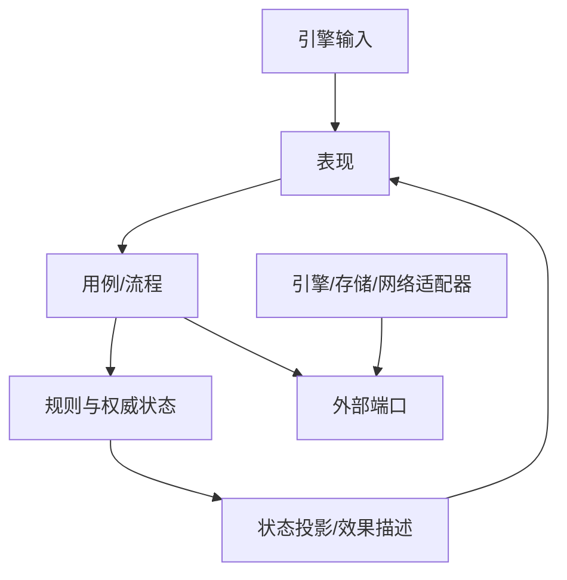

# <游戏/模块> 架构决策

> 使用 `game-architecture-guide.md` 讨论本模板。删除不适用的提示，不为填满章节制造抽象。

## 设计依据与边界

- 权威游戏设计：
- 相关章节：
- 当前项目/既有架构：
- 本次架构决策覆盖：
- 明确不覆盖：
- 不能由现有依据确定的问题：

## 架构驱动因素

### 玩家流程

列出核心玩家循环、主要场景/界面以及它们之间的进入和退出关系。

### 技术与产品约束

| 驱动因素 | 已确认事实 | 对架构的影响 | 权威来源 |
|---|---|---|---|
| 引擎与平台 |  |  |  |
| 性能与规模 |  |  |  |
| 联网与权威端 |  |  |  |
| 确定性/回放 |  |  |  |
| 存档与跨局状态 |  |  |  |
| 内容生产与变化方向 |  |  |  |

## 表现压力分析

从玩家看到的结果向下分析，不把表现层留到最后适配。

| 玩家触发 | 可见结果与时序 | 依赖的权威事实 | 并发/打断/重入 | 暂停/切场景/销毁 |
|---|---|---|---|---|
|  |  |  |  |  |

### 关键表现问题

- 哪些表现需要完整状态投影，而不能拼接底层内部状态：
- 哪些反馈属于只消费一次的效果：
- 哪些动画或异步反馈会与游戏流程协调：
- 哪些表现失败或取消不得影响游戏事实：

## 状态所有权

| 状态 | 类型：游戏事实/流程/表现/引擎对象/持久化表示 | 唯一所有者 | 写入者 | 读取方式 | 生命周期 | 可否重建及来源 |
|---|---|---|---|---|---|---|
|  |  |  |  |  |  |  |

检查是否存在多个权威来源、由 UI 反推游戏事实或需要手工同步的副本。

## 生命周期矩阵

| 对象或流程 | 创建 | 启动 | 暂停 | 恢复 | 取消/替换 | 销毁 | 责任模块 |
|---|---|---|---|---|---|---|---|
|  |  |  |  |  |  |  |  |

明确动画期间再次输入、切后台、网络断开、切场景和对象提前销毁时的语义。

## 表现契约

### 输入意图

| 意图 | 来源 | 业务参数 | 允许条件 | 拒绝结果 | 接收模块 |
|---|---|---|---|---|---|
|  |  |  |  |  |  |

### 状态投影

| 投影 | 服务的表现 | 权威来源 | 更新/失效方式 | 是否可重建 |
|---|---|---|---|---|
|  |  |  |  |  |

### 一次性效果

| 效果 | 触发依据 | 顺序/去重语义 | 消费者 | 取消或消费者不存在时 |
|---|---|---|---|---|
|  |  |  |  |  |

### 异步结果

说明完成、取消、超时、替换和销毁如何返回，以及流程是否需要等待表现。

## 候选架构

只列存在实质取舍的候选，可以组合场景中心、分层/领域、Feature Slice、ECS/数据导向及端口与适配器。

| 候选架构 | 结构摘要与适用区域 | 表现适配 | 状态与依赖 | 变化成本 | 性能/可验证性 | 复杂度与风险 |
|---|---|---|---|---|---|---|
| A |  |  |  |  |  |  |
| B |  |  |  |  |  |  |

### 候选结论

- 选择：
- 决定性理由：
- 否决方案及理由：
- 需要接受的代价：

## 最终架构

### 总体结构

用简图表达模块和单向依赖。可按需使用 Mermaid。

该图只是起点；按最终选择改写，删除不属于本项目的层次。

### 模块职责

| 模块 | 拥有的职责与状态 | 明确不负责 | 公共接口/事件 | 允许依赖 | 生命周期所有者 |
|---|---|---|---|---|---|
|  |  |  |  |  |  |

### 依赖规则

- 允许的依赖方向：
- 禁止的反向或跨层依赖：
- 跨模块协作方式：
- 共享规则或数据的唯一来源：

### 组合入口与引擎边界

- 具体实现在哪里组装：
- 哪些模块允许持有引擎类型或对象：
- 时间、随机数、输入、调度、存储、网络和资源分别如何接入：
- 场景节点、组件和资源句柄如何避免泄漏到不应依赖引擎的模块：

### 控制流与数据流

- 主控制流：
- 权威状态变更路径：
- 状态投影路径：
- 一次性效果路径：
- 错误、拒绝、取消和恢复路径：

## 代表性端到端纵切

选择最能暴露表现层和生命周期风险的一项体验。

1. 玩家输入：
2. 输入意图与校验：
3. 用例/流程协调：
4. 权威规则与状态变化：
5. 产生的状态投影和一次性效果：
6. 场景、UI、动画、音频或镜头反馈：
7. 暂停、取消、重入、切场景或销毁时的处理：

检查该路径是否访问内部状态、形成双向依赖、重复计算事实或依赖动画回调维持规则正确性。

## 架构质量复核

### 职责与位置

- 结论：
- 需调整项：

### 模块边界

- 结论：
- 需调整项：

### 内聚与耦合

- 结论：
- 需调整项：

### 单一来源

- 结论：
- 需调整项：

### 必要复杂度

- 结论：
- 需调整项：

### 设计一致性

- 结论：
- 需调整项：

## 风险与演进边界

| 风险或假设 | 当前处理 | 观察信号 | 触发何种架构调整 |
|---|---|---|---|
|  |  |  |  |

- 当前明确不引入的结构：
- 可延后到证据出现后再决定的结构：
- 仍需用户确认的问题：

## 最终决策摘要

- 采用的架构：
- 最关键的模块边界：
- 表现层如何获得完整且稳定的语义：
- 权威状态和生命周期由谁拥有：
- 选择该方案必须接受的主要代价：
- 用户确认项：
